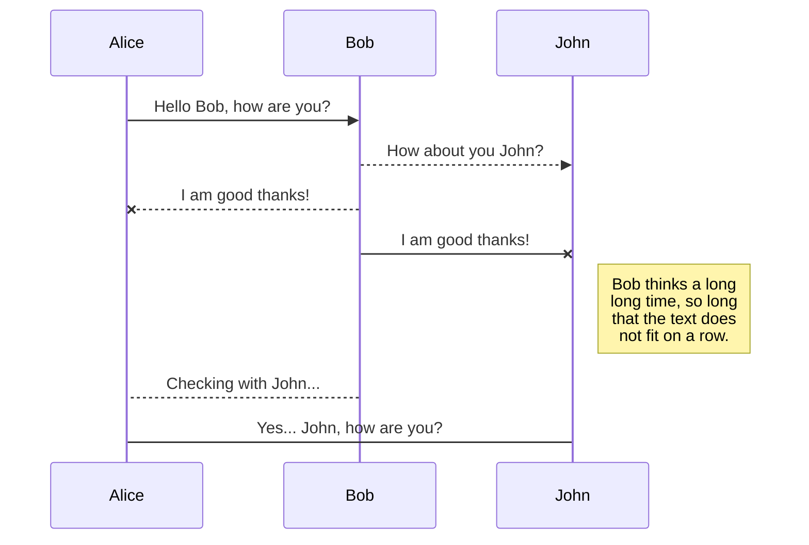
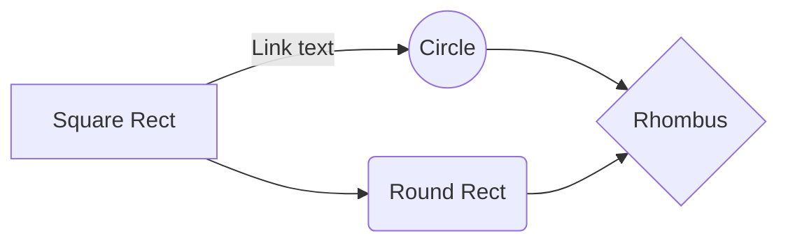

# Votee 

Votee is a blockchain based decentralized application that helps to improve the process of a voting by putting together the possibilities of advanced cryptography, PSD - AIS and blockchain as the layer of truth, that has been developed during the Open Banking Hackathon in Warsaw.

## Running a test environment 

1. Make sure that Docker is installed on your machine
2. Clone this repository
3. Run `docker build -t votee .` to build the docker image
4. Run the docker image using `docker run -p 7545:8545 votee`, after this a 10 private keys will appear on the screen please copy them.
5. Make sure that the `package.json` development dependencies are installed
6. Deploy the smart contracts using `npx truffle migrate --network development --reset`. After this step on the screen will appear something called `Deploying 'Votee` and an object from the object copy the property `contract address`
Now the test env is ready to go.

## Running the tests

1. To run the test you need to go to `test/test.js` and replace the variables `providerUrl` and `contractAddress` with yours. If you're using a test env the proper `providerUrl` with be `http://localhost:7545` if it's running locally.
2. In the previous step when the contract were deployed the `contract address` should be copied, the copied value should be provided as `contractAddress`. 
3. Inside the root directory create a file called `.privateKey` and put there the first private key that appeared on the screen when the docker image has been run + a `0x` in the begging. 
4. Run the test using `yarn test` remember to build the javascript files if they're not using `yarn build`

## Flow TODO

You can render UML diagrams using [Mermaid](https://mermaidjs.github.io/). For example, this will produce a sequence diagram:

And this will produce a flow chart:

